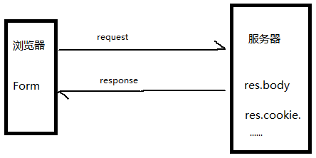

# body-parser
Express是一个基于Node.js平台的web应用开发框架，Node.js基础之上扩展了web应用开发所需要的基础功能，从而使得我们开发Web应用更加方便、更加快捷，
在express框架中，通过中间件的使用来调用第三方库，这些库让我们开发更方便，也更容易开发出各种更加强大的应用程序。而body-parser是express中的比较常用的第三方中间件。

## 中间件的理解

浏览器向服务器发送一个请求后，服务器得到request携带过去的数据（用户输入数据和浏览器本身数据）。这中间就一定有一个函数将这些数据分类做了处理，已经处理好了，最后让request对象调用使用，对的，这个处理数据处理函数就是我们要说的 中间件 。
## 安装

```sh
$ npm install body-parser
```

## API

<!-- eslint-disable no-unused-vars -->

```js
var bodyParser = require('body-parser')
```

bodyParser用于解析客户端请求的body中的内容，内部使用json数据、Buffer流数据、文本数据、UTF-8的编码的数据。

### bodyParser.json([options]) .

返回只解析json的中间件，只查看内容类型头与类型选项匹配的请求。该解析器接受体的任何Unicode编码，支持gzip自动解压缩和压缩编码。

包含解析数据的新的body对象在中间件(即req.body)之后的请求对象上进行填充。

#### Options

json函数接受一个可选的选项对象，该对象可以包含以下属性:

##### inflate

当设置true，然后压缩机构将解压; 当错误的、压缩的主体被拒绝的时候。默认值为true。

##### limit

控制最大请求主体大小。如果这是一个数字，则该值指定字节数; 如果它是一个字符串，则将该值传递给
[字节](https://www.npmjs.com/package/bytes) 库 。 默认为 `'100kb'`.

##### reviver

修订选项直接传递给JSON。解析为第二个参数。 您可以在关于
[JSON.parse的MDN文档](https://developer.mozilla.org/en-US/docs/Web/JavaScript/Reference/Global_Objects/JSON/parse#Example.3A_Using_the_reviver_parameter).
找到更多关于这个参数的信息。
##### strict

当设置为`true`时，只接受数组和对象;当`false`将接受任何JSON。解析接受。默认值为`true`。
##### type

类型选项用于确定中间件将解析的媒体类型。这个选项可以是字符串、字符串数组或函数。
如果不是一个函数，type选项直接传递给type - library，它可以是一个扩展名(如json)，
mime类型(如应用程序/ json)，或者是带有通配符的mime类型(如* / *或* / json)。
如果一个函数，类型选项被调用为fn(req)，如果它返回一个truthy值，请求就会被解析。
默认为application / json。

##### verify

如果提供了验证选项，则称为验证(req,res,buf,encoding)，buf是原始请求体的缓冲区，编码是请求的编码。可以通过抛出错误来中止解析。

### bodyParser.raw([options])

返回中间件，将所有的实体解析为缓冲区，只查看内容类型头与类型选项匹配的请求。该解析器支持gzip的自动解压缩和压缩编码。

包含解析数据的新的body对象在中间件(即req.body)之后的请求对象上进行填充。这将是buffer主体的缓冲对象。

#### Options

原始函数接受一个可选选项，该对象可能包含以下属性:

##### inflate

设置为true时，deflate压缩数据会被解压缩；设置为true时，deflate压缩数据会被拒绝。默认为true。

##### limit

控制最大请求主体大小。如果这是一个数字，则该值指定字节数; 如果它是一个字符串，则将该值传递给 字节库进行解析。默认为'100kb'。

##### type

类型选项用于确定中间件将解析的媒体类型。这个选项可以是字符串、字符串数组或函数。如果不是一个函数，
type选项直接传递给type - library，它可以是一个扩展名(如bin)，
一个mime类型(如应用程序/ octet- stream)，或者一个带有通配符的mime类型(如* / *或应用程序/ *)。
如果一个函数，类型选项被调用为fn(req)，如果它返回一个truthy值，请求就会被解析。默认应用程序/八进制。

##### verify

如果提供了验证选项，则称为验证(req,res,buf,encoding)，buf是原始请求体的缓冲区，编码是请求的编码。可以通过抛出错误来中止解析。

### bodyParser.text([options])

返回中间件，将所有的实体解析为字符串，只查看内容类型头与类型选项匹配的请求。该解析器支持gzip的自动解压缩和压缩编码。

在中间件(即req.body)之后，在请求对象上填充包含解析数据的新体字符串。这将是一个主体的字符串。
#### Options

原始函数接受一个可选选项，该对象可能包含以下属性:
##### defaultCharset

如果Content-Type在请求的标题中未指定字符集，请指定文本内容的缺省字符集。默认为utf-8。
##### inflate

设置为true时，deflate压缩数据会被解压缩；设置为true时，deflate压缩数据会被拒绝。默认为true。

##### limit

控制最大请求主体大小。如果这是一个数字，则该值指定字节数; 如果它是一个字符串，则将该值传递给 字节库进行解析。默认为'100kb'。

##### type

该type选项用于确定中间件将解析的媒体类型。该选项可以是字符串，字符串数组或函数。
如果不是函数，则type选项直接传递到 类型库，这可以是扩展名（like txt），
MIME类型（like text/pl     ain）或带有通配符（如*/*or text/*）的MIME类型。
如果一个函数，这个type 选项被调用，fn(req)并且如果返回一个真值，
那么请求被解析。默认为text/plain。
##### verify

该verify选项（如果提供）被称为verify(req, res, buf, encoding)，其中buf是Buffer原始请求主体，并且encoding是请求的编码。抛出错误可以中止解析。
### bodyParser.urlencoded([options])

返回仅解析urlencoded正文的中间件，只查看Content-Type头部与type选项匹配的请求。此解析器只接受身体的UTF-8编码，并支持自动膨胀gzip和deflate编码。
body包含解析数据的新对象request 在中间件（ie req.body）之后被填充在对象上。该对象将包含键-值对，
其中该值可以是一个字符串或阵列（时extended是 false），或任何类型的（当extended是true）。
#### Options

该urlencoded函数采用options可能包含以下任何键的可选属性：

##### extended

该extended选项允许选择是将URL编码的数据与querystring库（当值为false）或qs库（当值为true）解析。“extended”语法允许将丰富的对象和数组编码为URL编码的格式，从而允许使用URL编码的类似JSON的体验。有关更多信息，请 参阅qs库。(https://www.npmjs.org/package/qs#readme).

D默认为true，但使用默认已被弃用。请研究和之间的差异qs，querystring并选择适当的设置。

##### inflate

When set to `true`, then deflated (compressed) bodies will be inflated; when
`false`, deflated bodies are rejected. Defaults to `true`.

##### limit

设置为true时，deflate压缩数据会被解压缩；设置为true时，deflate压缩数据会被拒绝。默认为true。
limit

控制最大请求主体大小。如果这是一个数字，则该值指定字节数; 如果它是一个字符串，则将该值传递给 字节库进行解析。默认为'100kb'。

##### parameterLimit

该parameterLimit选项控制URL编码数据中允许的最大参数数量。如果一个请求包含比这个值更多的参数，一个413将被返回给客户端。默认为1000。

##### type

该type选项用于确定中间件将解析的媒体类型。该选项可以是字符串，字符串数组或函数。如果不是函数，则type选项直接传递到 类型库，这可以是扩展名（like urlencoded），MIME类型（like application/x-www-form-urlencoded）或带有通配符（如*/x-www-form-urlencoded）的MIME类型 。如果一个函数，这个type选项被调用， fn(req)并且如果返回一个真值，那么请求被解析。默认为application/x-www-form-urlencoded。

##### verify

该verify选项（如果提供）被称为verify(req, res, buf, encoding)，其中buf是Buffer原始请求主体，并且encoding是请求的编码。抛出错误可以中止解析。

## Exampless三种用法

### 底层中间件用法： 

这将拦截和解析所有的请求；也即这种用法是全局的。

```js
var express = require('express')
var bodyParser = require('body-parser')

var app = express()

// parse application/x-www-form-urlencoded
app.use(bodyParser.urlencoded({ extended: false }))

// parse application/json
app.use(bodyParser.json())

app.use(function (req, res) {
  res.setHeader('Content-Type', 'text/plain')
  res.write('you posted:\n')
  res.end(JSON.stringify(req.body, null, 2))
})
```

### 特定路由下的中间件用法

这种用法是针对特定路由下的特定请求的，只有请求该路由时，中间件才会拦截和解析该请求；也即这种用法是局部的

```js
var express = require('express')
var bodyParser = require('body-parser')

var app = express()

// create application/json parser
var jsonParser = bodyParser.json()

// create application/x-www-form-urlencoded parser
var urlencodedParser = bodyParser.urlencoded({ extended: false })

// POST /login gets urlencoded bodies
app.post('/login', urlencodedParser, function (req, res) {
  if (!req.body) return res.sendStatus(400)
  res.send('welcome, ' + req.body.username)
})

// POST /api/users gets JSON bodies
app.post('/api/users', jsonParser, function (req, res) {
  if (!req.body) return res.sendStatus(400)
  // create user in req.body
})
```

### 设置Content-Type 属性

用于修改和设定中间件解析的body类容类型。

```js
var express = require('express')
var bodyParser = require('body-parser')

var app = express()

// parse various different custom JSON types as JSON
app.use(bodyParser.json({ type: 'application/*+json' }))

// parse some custom thing into a Buffer
app.use(bodyParser.raw({ type: 'application/vnd.custom-type' }))

// parse an HTML body into a string
app.use(bodyParser.text({ type: 'text/html' }))
```

## License

[MIT](证书)

[npm-image]: https://img.shields.io/npm/v/body-parser.svg
[npm-url]: https://npmjs.org/package/body-parser
[travis-image]: https://img.shields.io/travis/expressjs/body-parser/master.svg
[travis-url]: https://travis-ci.org/expressjs/body-parser
[coveralls-image]: https://img.shields.io/coveralls/expressjs/body-parser/master.svg
[coveralls-url]: https://coveralls.io/r/expressjs/body-parser?branch=master
[downloads-image]: https://img.shields.io/npm/dm/body-parser.svg
[downloads-url]: https://npmjs.org/package/body-parser
[gratipay-image]: https://img.shields.io/gratipay/dougwilson.svg
[gratipay-url]: https://www.gratipay.com/dougwilson/
